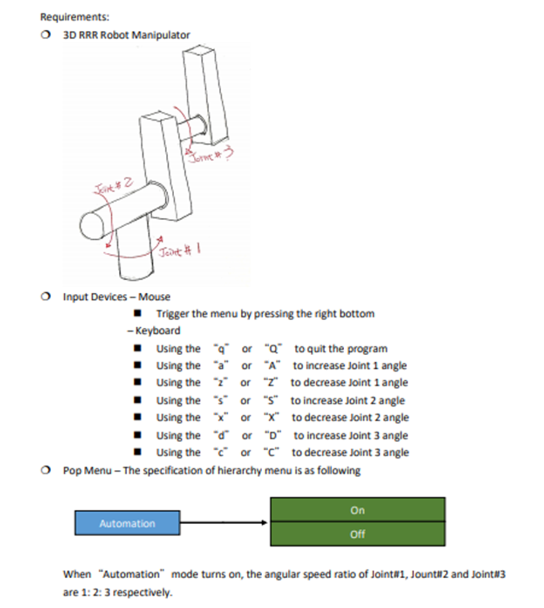
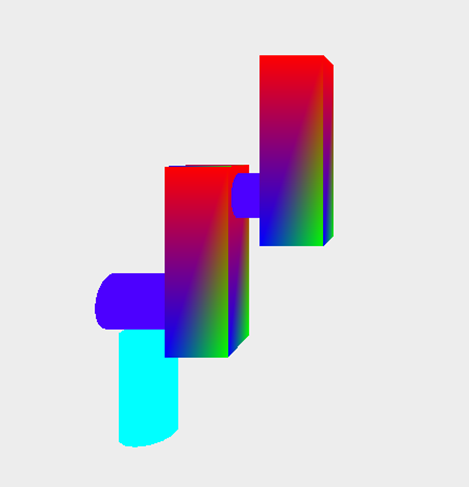
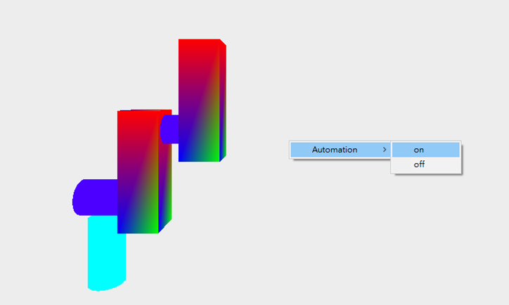

(一)問題描述(Problem Description)

(二)程式編譯環境(Program compilation environment)

1. 程式語言(Programming language)
        C++ in MS Windows
2. 程式開發工具(Programming tools)
        Visual C++ 2019
3. 電腦硬體(Computer Hardware)
        CPU: Intel i5, Main Memory: 4GB,系統類型:64位元作業系統

(三)實驗結果(Experimental Results)

