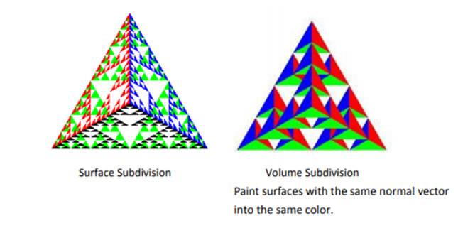
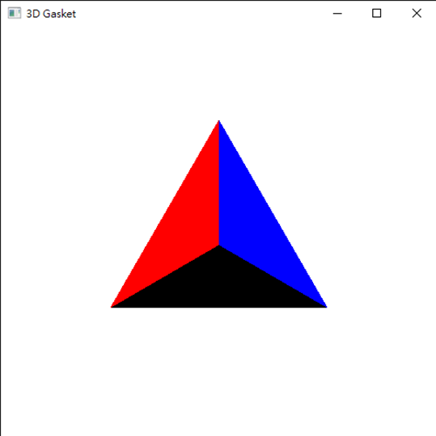
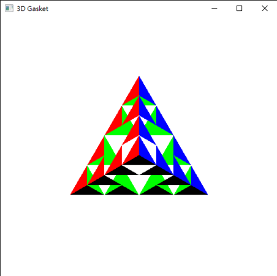
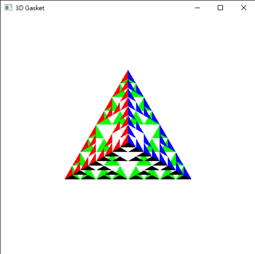
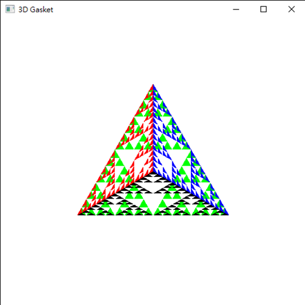

(一)問題描述(Problem Description)

1.3D Gasket – Regular tetrahedron with surface/volume subdivision
2.Input Devices – Mouse  
              Trigger the menu by pressing the right bottom
             – Keyboard 
              Using the “q” or “Q” to quit the program
3.Pop Menu – The specification of hierarchy menu is as following

(二)程式編譯環境(Program compilation environment)

1. 程式語言(Programming language)
        C++ in MS Windows
2. 程式開發工具(Programming tools)
        Visual C++ 2019
3. 電腦硬體(Computer Hardware)
        CPU: Intel i5, Main Memory: 4GB,系統類型:64位元作業系統

(三)實驗結果(Experimental Results)

初始畫面:

N = 2

N = 3

N = 4

